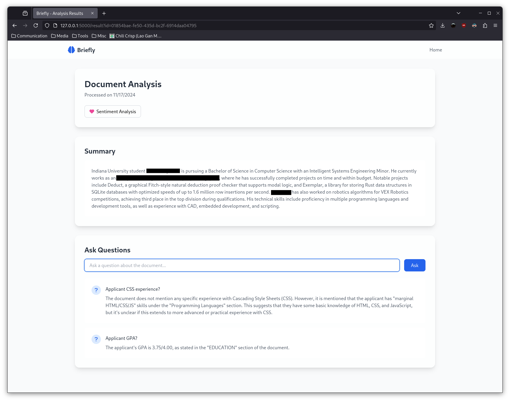

<h1 align="center">Briefly</h1>
<h3 align="center">
    A simple document summarizer and interrogator. Built for the 2024 Luddy Hackathon.
</h3>

## Features
- Web interface for summarizing and interrogating documents using a local language model.
- Supports PDFs, Excel documents, MP3s (via Whisper transcription), and text files.
- Optional document sentiment analysis using a BERT finetune.

    

## Installation
Briefly uses `uv` to handle the Python interpreter and dependencies, so simply cloning the repository and running `uv venv`/`uv sync` will get you set up.

You should also have the Ollama service running with the Llama 3.1 8B language model registered.
